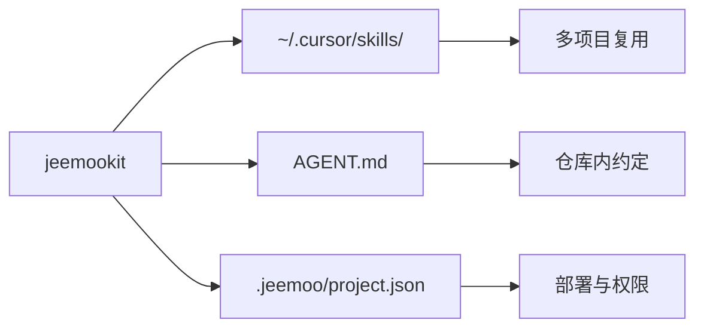
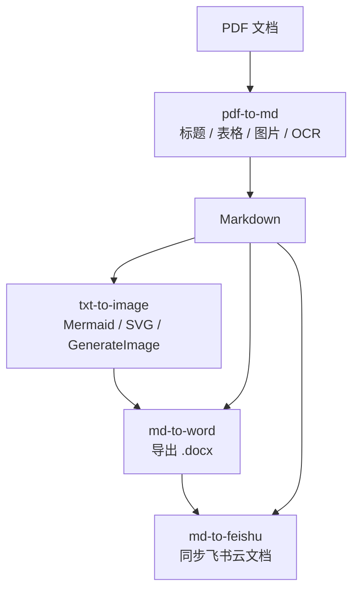
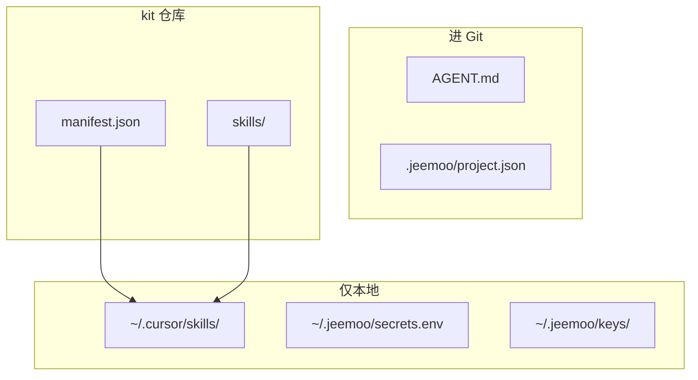
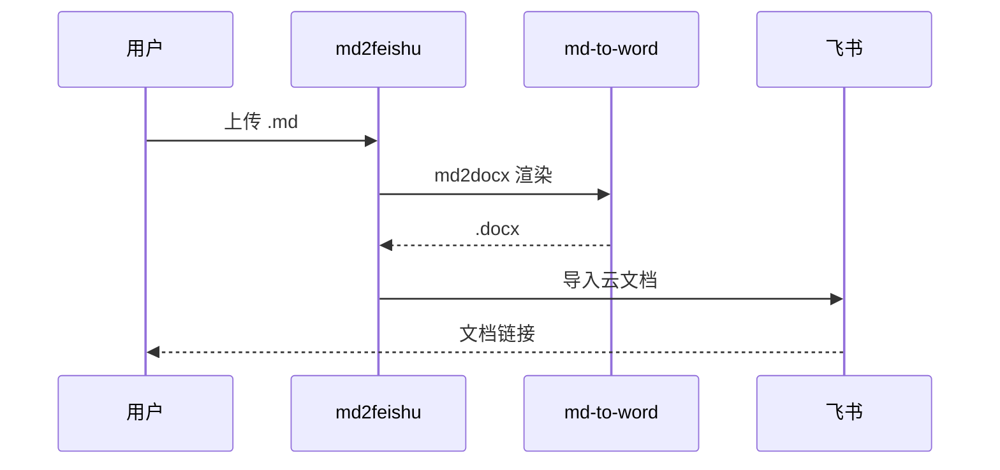
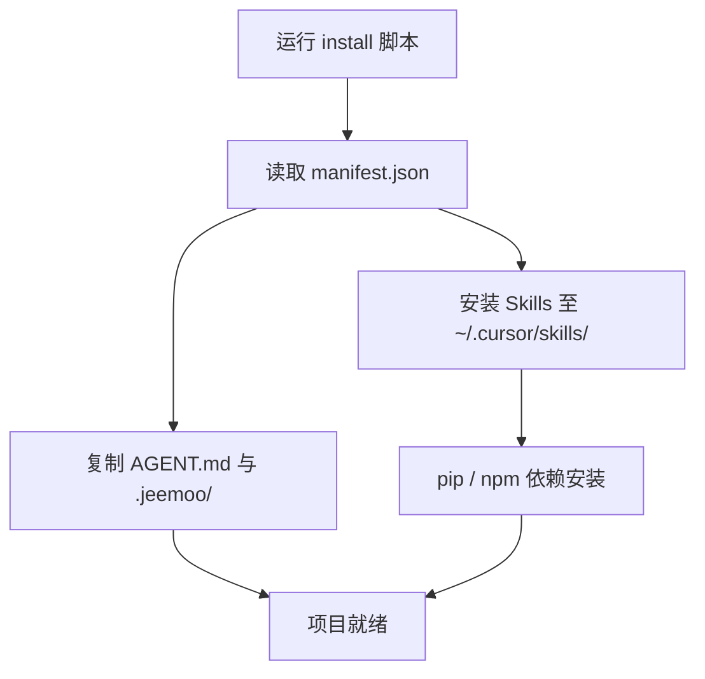

# jeemookit 产品介绍说明书

| 项目 | 内容 |
|------|------|
| 产品名称 | jeemookit |
| 当前版本 | 1.3.0 |
| 产品定位 | Jeemoo 新项目初始化模板与 Cursor Agent 协作工具包 |
| 适用平台 | Windows / macOS / Linux |
| 许可协议 | MIT |

---

## 1. 产品概述

**jeemookit** 面向 **1 人 + AI** 开发模式，在新项目启动时一键注入可复制的工程底座：

| 能力 | 说明 |
|------|------|
| 全局 Skills | 安装至 `~/.cursor/skills/`，跨项目复用文档转换、配图、导出等能力 |
| 项目 Agent 约定 | `AGENT.md` 定义目录结构、文档规范与协作规则 |
| 部署元数据 | `.jeemoo/project.json` 记录部署目标与 Agent 权限；密钥本地保管 |

jeemookit **不替代**业务框架，专注解决「Agent 能力、文档规范、部署约定如何统一落地」。



---

## 2. 目标用户与场景

### 2.1 目标用户

| 用户类型 | 典型诉求 |
|----------|----------|
| 独立开发者 | 快速启动新项目，减少重复配置 |
| 小团队技术负责人 | 统一 Agent 协作规范与文档标准 |
| 文档 / 专利撰写者 | Markdown ↔ Word / 飞书；PDF 提取转 MD |
| Cursor 重度用户 | Skills 全局安装、约定进 Git、密钥不进仓 |

### 2.2 典型场景


*图：1 人 + AI 完成文档编写、配图、导出与协作分享*

| 场景 | 涉及 Skill |
|------|-----------|
| 新建 Web / API / 管理后台 | `install.sh` / `install.ps1` |
| PDF 公文 / 通知 / 扫描件转 MD | `pdf-to-md`（含 OCR） |
| 编写技术方案 / 功能设计 | `txt-to-image`（Mermaid 结构图） |
| 撰写专利交底书 | `txt-to-image`（SVG）+ `md-to-word` |
| 文档协作分享 | `md-to-feishu` |

---

## 3. 核心价值

### 3.1 文档生产链路

内置 Skills 覆盖「PDF 提取 → 编写配图 → 导出 → 协作」：



### 3.2 配置与密钥分离



| 内容 | 存放位置 | 进 Git |
|------|----------|--------|
| Skills 源码 | kit 仓库 → `~/.cursor/skills/` | kit ✅ |
| AGENT.md | 项目根目录 | 项目 ✅ |
| 部署元数据 | `.jeemoo/project.json` | 项目 ✅ |
| API 密钥、SSH 密钥 | `~/.jeemoo/secrets.env`、`keys/` | ❌ |

`project.json` 的 `permissions` 字段控制 Agent 是否可自动部署，默认需人工确认。

### 3.3 设计原则

1. **关注点分离** — Skills 全局、约定进仓、密钥本地
2. **声明式清单** — `manifest.json` 驱动安装，无硬编码
3. **可组合 Skill 链** — `md-to-feishu` 复用 `md-to-word` 渲染管线
4. **Agent 友好** — 模板与 Skill 提供明确工作流
5. **渐进式安装** — 支持 `--skills-only`、`--agent-only` 等粒度

---

## 4. 内置 Skills

### 4.1 总览

| Skill | 版本 | 功能 | 依赖 |
|-------|------|------|------|
| `pdf-to-md` | 1.0.0 | PDF → Markdown；标题、表格、图片提取；扫描件 OCR | Python 3.10+ |
| `md-to-word` | 1.0.0 | MD → Word；Mermaid / SVG / 图片渲染嵌入 | Python 3.10+、Node.js 18+ |
| `txt-to-image` | 1.0.0 | 文档配图规范（见下表） | 无 |
| `md-to-feishu` | 1.2.0 | MD → 飞书云文档（默认格式同步） | Python、`requests`、飞书 OAuth |

### 4.2 txt-to-image · 三类配图

| 类型 | 适用 | 格式 | 工具 | 存放 |
|------|------|------|------|------|
| 结构图 | 架构、流程、时序 | Mermaid | Agent 编写 | 内嵌 Markdown |
| 专利图 | 交底书附图 | SVG | Agent 编写 | `assets/图N-描述.svg` |
| 宣传图 | 用户场景、主视觉 | PNG | GenerateImage | `assets/主题-简述.png` |

专利图禁用 GenerateImage；外部图统一放文档同级 `assets/`（`pdf-to-md` 默认输出 `<文件名>_assets/`）。

### 4.3 pdf-to-md

将 PDF 转为可编辑 Markdown，支持可选文本 PDF 与扫描件 OCR（中文）：

| 内容 | 文本 PDF | 扫描 PDF |
|------|----------|----------|
| 标题层级 | 字体大小 + 加粗 | OCR + 公文格式（一、二、） |
| 表格 | pdfplumber → MD 表格 | 简单列对齐；复杂表单保留页图 |
| 图片 | 提取嵌入图 | 表单页导出 PNG |

```bash
python ~/.cursor/skills/pdf-to-md/scripts/pdf2md.py "路径/文档.pdf"
python ~/.cursor/skills/pdf-to-md/scripts/pdf2md.py "文档.pdf" -o "输出/文档.md"
```

图片默认保存至 `<md文件名>_assets/`。转换后可衔接 `md-to-word`、`md-to-feishu` 继续导出。

### 4.4 md-to-word

将含 Mermaid、SVG、图片的 Markdown 导出为 `.docx`：

| Markdown 元素 | 处理方式 |
|---------------|----------|
| ` ```mermaid ` | mermaid-cli 渲染 PNG 嵌入 |
| `**图N**（`assets/xxx.svg`）` | Chromium 渲染 SVG 嵌入 |
| `` | 直接嵌入 |

```bash
python ~/.cursor/skills/md-to-word/scripts/md2docx.py "路径/文档.md"
```

缓存：项目根 `.cache/md2docx/`。

### 4.5 md-to-feishu

默认**格式同步**，复用 `md-to-word` 渲染后再导入飞书：



```bash
python ~/.cursor/skills/md-to-feishu/scripts/md2feishu.py login   # 首次 OAuth
python ~/.cursor/skills/md-to-feishu/scripts/md2feishu.py "路径/文档.md"
```

凭证：`~/.jeemoo/secrets.env`（参考 `templates/secrets.env.example`）。

| 模式 | 上限 | 说明 |
|------|------|------|
| 默认同步 | 600MB | Mermaid / SVG 可渲染 |
| `--no-sync` | 20MB | 原始 MD，不渲染图表 |

---

## 5. 安装与使用

### 5.1 环境要求

Cursor IDE · Python 3.10+ · Node.js 18+ · Windows（PS 5.1+）/ macOS / Linux

### 5.2 一键初始化

```bash
# macOS / Linux
chmod +x /path/to/jeemookit/install.sh
/path/to/jeemookit/install.sh --project-root /path/to/my-new-project
```

```powershell
# Windows
D:\Dev\jeemookit\install.ps1 -ProjectRoot D:\Dev\my-new-project
```



| 参数 | 说明 |
|------|------|
| `--project-root` / `-ProjectRoot` | 目标项目路径 |
| `--skills-only` / `-SkillsOnly` | 仅安装全局 Skills |
| `--agent-only` / `-AgentOnly` | 仅复制 AGENT.md 与项目配置 |
| `--skip-deps` / `-SkipDeps` | 跳过 pip / npm |
| `--force-agent` / `-ForceAgent` | 覆盖已有 AGENT.md |

### 5.3 初始化后结构

```
~/.cursor/skills/          # 全局 Skills
├── pdf-to-md/
├── md-to-word/
├── txt-to-image/
└── md-to-feishu/

my-app/                    # 目标项目
├── AGENT.md
├── .jeemoo/project.json
├── doc/
├── src/
└── scripts/
```

---

## 6. 产品组成与扩展

### 6.1 组件清单

| 组件 | 说明 |
|------|------|
| `install.sh` / `install.ps1` | 一键安装脚本 |
| `manifest.json` | Skills 与模板的单一事实来源 |
| `templates/` | AGENT.md、project.json、secrets.env.example |
| `skills/` | pdf-to-md、md-to-word、txt-to-image、md-to-feishu |

### 6.2 扩展 kit

1. 在 `skills/<name>/` 新增 Skill（含 `SKILL.md`）
2. 在 `manifest.json` 注册 id、version、path、依赖
3. 更新 `templates/AGENT.md` 与 `secrets.env.example`

---

## 7. 安全说明

- 密钥（SSH、API Key、飞书 Secret）仅存 `~/.jeemoo/`，**永不进 Git**
- `project.json` 限制 Agent 自动部署范围
- 飞书默认浏览器 OAuth，无需在仓库配置机器人凭证

---

## 8. 快速参考

| 需求 | 操作 |
|------|------|
| 新项目初始化 | `install.sh` / `install.ps1` |
| PDF 转 Markdown | 「PDF 转 MD」或 `pdf2md.py` |
| 文档配图 | `@skills/txt-to-image` 或说明图类型 |
| 导出 Word | 「导出 Word」或 `md2docx.py` |
| 上传飞书 | 「上传到飞书」或 `md2feishu.py` |
| 配置飞书 | `secrets.env.example` → `~/.jeemoo/secrets.env` |
| 扩展 Skill | 编辑 `manifest.json` + 新增 `skills/<name>/` |

### 版本历史

| 版本 | 主要变化 |
|------|----------|
| 1.3.0 | 新增 `pdf-to-md` Skill（PDF → Markdown，含 OCR） |
| 1.2.0 | 新增 `md-to-feishu`；配图 Skill 更名为 `txt-to-image`；专利图统一 `assets/` |
| 1.0.0 | 初始版本：`md-to-word`、配图规范、AGENT 与 project 模板 |

---

*本文档描述 jeemookit v1.3.0。命令细节与故障排查见 [README.md](../README.md) 及各 Skill 的 `SKILL.md`。*
