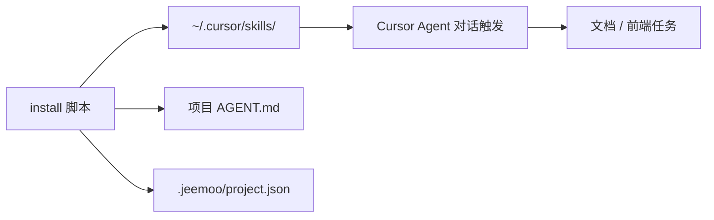
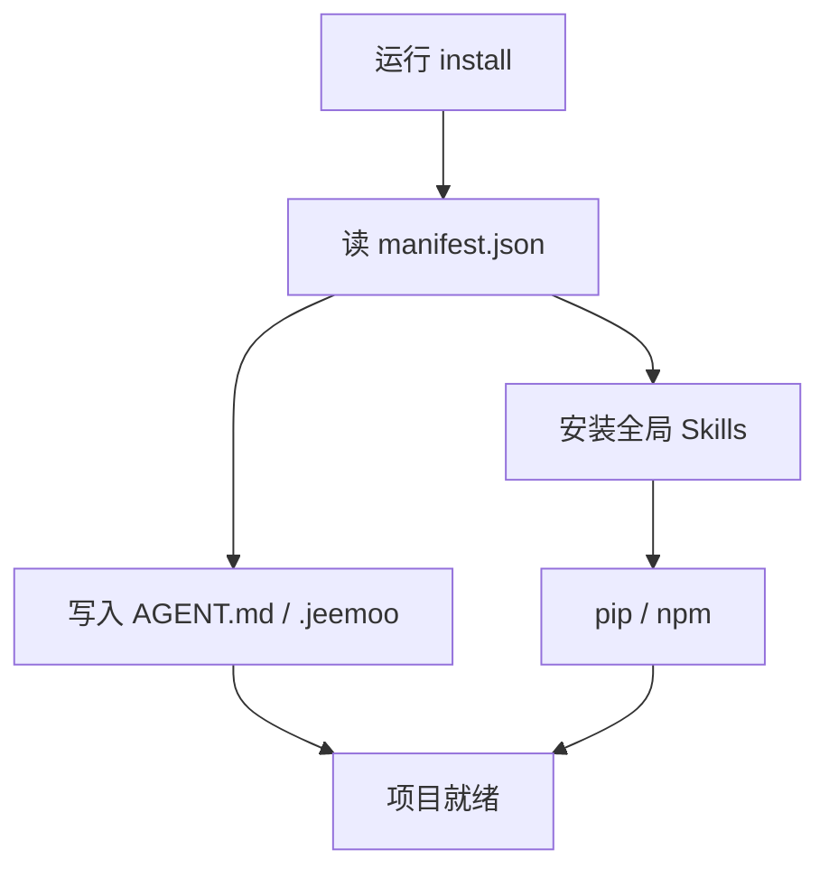
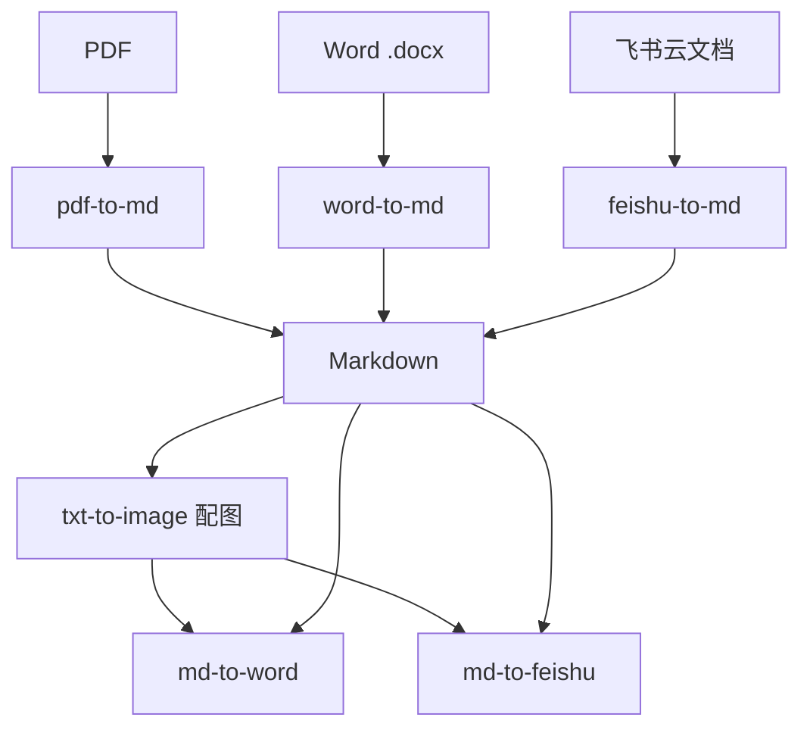

# jeemookit 产品使用说明书

| 项目 | 内容 |
|------|------|
| 产品名称 | jeemookit |
| 当前版本 | 1.4.0 |
| 文档类型 | 产品使用说明书 |
| 适用平台 | Windows / macOS / Linux |
| 许可协议 | MIT |

---

## 1. 产品是什么

**jeemookit** 是 Jeemoo 的 Cursor Agent 协作工具包：在新项目启动时一键安装全局 Skills、项目 `AGENT.md` 与部署元数据，让「1 人 + AI」能稳定完成文档转换、配图导出、飞书同步与前端落地页设计。


*图：文档生产主链路示意*



---

## 2. 使用前准备

### 2.1 环境要求

| 组件 | 要求 |
|------|------|
| Cursor | 已安装并可用 Agent |
| Python | 3.10+（`python` 在 PATH 中） |
| Node.js | 18+（`md-to-word` / `md-to-feishu` 渲染图表） |
| 系统 | Windows PowerShell 5.1+ / macOS / Linux |

### 2.2 获取 kit

将本仓库克隆到本机固定路径，例如：

- Windows：`D:\Dev\jeemookit`
- macOS / Linux：`~/Dev/jeemookit`

后续安装命令均以该路径为 kit 根目录。

---

## 3. 安装与初始化

### 3.1 新项目一键初始化（推荐）

**Windows：**

```powershell
D:\Dev\jeemookit\install.ps1 -ProjectRoot D:\Dev\my-new-project
```

**macOS / Linux：**

```bash
chmod +x /path/to/jeemookit/install.sh
/path/to/jeemookit/install.sh --project-root /path/to/my-new-project
```

脚本会：

1. 读取 `manifest.json`
2. 把 Skills 复制到 `~/.cursor/skills/`（Windows：`%USERPROFILE%\.cursor\skills\`）
3. 按需执行 pip / npm 依赖安装
4. 向目标项目写入 `AGENT.md`、`.jeemoo/project.json`、启动脚本模板



### 3.2 常用参数

| 参数 | 说明 |
|------|------|
| `-ProjectRoot` / `--project-root` | 目标项目路径（不存在则创建） |
| `-SkillsOnly` / `--skills-only` | 仅更新全局 Skills |
| `-AgentOnly` / `--agent-only` | 仅复制 AGENT.md 与项目配置 |
| `-SkipDeps` / `--skip-deps` | 跳过 pip / npm |
| `-ForceAgent` / `--force-agent` | 覆盖已有 `AGENT.md` |
| `-ForceProject` / `--force-project` | 覆盖 `.jeemoo/project.json` |

**只升级 Skills（日常最常用）：**

```powershell
D:\Dev\jeemookit\install.ps1 -SkillsOnly
```

```bash
/path/to/jeemookit/install.sh --skills-only
```

### 3.3 安装后目录

```
~/.cursor/skills/
├── pdf-to-md/
├── word-to-md/
├── md-to-word/
├── txt-to-image/
├── md-to-feishu/
├── feishu-to-md/
└── design-taste-frontend/

my-app/
├── AGENT.md
├── .jeemoo/
│   ├── project.json
│   └── .gitignore
└── scripts/          # start.sh / start.ps1（若模板已提供）
```

安装完成后：**新开一个 Cursor Agent 对话**，Skills 才会被重新发现。

---

## 4. 在 Cursor 里怎么用

### 4.1 基本方式

在 Agent 对话中用自然语言描述任务即可，例如：

| 你想说 | Agent 会调用的 Skill |
|--------|----------------------|
| 「把这份 PDF 转成 Markdown」 | `pdf-to-md` |
| 「Word 转 MD」 | `word-to-md` |
| 「给设计文档画架构图 / 导出 Word」 | `txt-to-image` → `md-to-word` |
| 「上传到飞书」 | `md-to-feishu` |
| 「把飞书文档下载成 md」 | `feishu-to-md` |
| 「按 taste-skill 做落地页」 | `design-taste-frontend` |

也可以显式点名：`用 design-taste-frontend`、`@skills/txt-to-image`。

### 4.2 文档生产主链路



建议顺序：**导入 → 编写/配图 → 导出 Word 或同步飞书**。

---

## 5. Skills 使用说明

以下路径以 macOS/Linux 为例；Windows 将 `~/.cursor/skills/` 换成 `$env:USERPROFILE\.cursor\skills\`。

### 5.1 pdf-to-md · PDF → Markdown

**用途：** 文本 PDF / 扫描件（中文 OCR）转可编辑 Markdown。

```bash
python ~/.cursor/skills/pdf-to-md/scripts/pdf2md.py "路径/文档.pdf"
python ~/.cursor/skills/pdf-to-md/scripts/pdf2md.py "文档.pdf" -o "输出/文档.md"
```

| 内容 | 文本 PDF | 扫描 PDF |
|------|----------|----------|
| 标题 | 字体大小 + 加粗 | OCR + 公文格式（一、二、） |
| 表格 | → MD 表格 | 简单列对齐；复杂表单保留页图 |
| 图片 | 提取嵌入图 | 表单页导出 PNG |

图片默认在 `<md文件名>_assets/`。

### 5.2 word-to-md · Word → Markdown

**用途：** `.docx` 转 MD（标题 / 列表 / 表格 / 图片）。不支持旧版 `.doc`。

```bash
python ~/.cursor/skills/word-to-md/scripts/docx2md.py "路径/文档.docx"
python ~/.cursor/skills/word-to-md/scripts/docx2md.py "文档.docx" -o "输出/文档.md"
```

### 5.3 txt-to-image · 文档配图

**用途：** 为 Markdown 选对配图方式（规范型 Skill，无独立脚本）。

| 类型 | 适用 | 格式 | 存放 |
|------|------|------|------|
| 结构图 | 架构、流程、时序 | Mermaid 代码块 | 内嵌 MD |
| 专利图 | 交底书附图 | SVG | `assets/图N-描述.svg` |
| 宣传图 | 场景、主视觉 | PNG（GenerateImage） | `assets/主题-简述.png` |

对话示例：「给技术方案补整体架构 Mermaid」「专利交底书画图 1」「产品说明书加用户场景图」。

专利图禁用 GenerateImage；外部图统一放文档同级 `assets/`。

### 5.4 md-to-word · Markdown → Word

**用途：** 导出 `.docx`，自动渲染 Mermaid / SVG / 图片。

```bash
python ~/.cursor/skills/md-to-word/scripts/md2docx.py "路径/文档.md"
```

缓存目录：项目根 `.cache/md2docx/`。

### 5.5 md-to-feishu · Markdown → 飞书

**用途：** 上传为飞书云文档；默认经 `md-to-word` 渲染后再导入（格式同步）。

**首次配置：**

1. 复制 `templates/secrets.env.example` → `~/.jeemoo/secrets.env`
2. 填写 `FEISHU_APP_ID`、`FEISHU_APP_SECRET` 等
3. 登录：

```bash
python ~/.cursor/skills/md-to-feishu/scripts/md2feishu.py login
```

**上传：**

```bash
python ~/.cursor/skills/md-to-feishu/scripts/md2feishu.py "路径/文档.md"
python ~/.cursor/skills/md-to-feishu/scripts/md2feishu.py "文档.md" -t "自定义标题"
python ~/.cursor/skills/md-to-feishu/scripts/md2feishu.py "文档.md" --no-sync   # 原始 MD，不渲染图表
```

| 模式 | 上限 | 说明 |
|------|------|------|
| 默认同步 | 600MB | Mermaid / SVG 可渲染 |
| `--no-sync` | 20MB | 原始 MD |

### 5.6 feishu-to-md · 飞书 → Markdown

**用途：** 拉取飞书云文档为本地 MD（尽量保留标题、表格，并本地化图片）。

```bash
python ~/.cursor/skills/feishu-to-md/scripts/feishu2md.py login
python ~/.cursor/skills/feishu-to-md/scripts/feishu2md.py "https://xxx.feishu.cn/docx/XXXXXXXXXXXX"
python ~/.cursor/skills/feishu-to-md/scripts/feishu2md.py "doxcnXXXXXXXXXXXX" -o ./doc
```

凭证与 `md-to-feishu` 共用 `~/.jeemoo/secrets.env`。

### 5.7 design-taste-frontend · 前端落地页 / 改版

**用途：** Anti-slop 前端（落地页、作品集、营销站、UI 改版）。不适用仪表盘、复杂数据表、多步表单。

对话示例：

- 「用 design-taste-frontend 做 SaaS 落地页」
- 「按 taste-skill 改版现有首页」

Agent 会按序：**Brief 推断 → 三档 Dial → 选型 → 实现 → Pre-Flight**。细则见该 Skill 的 `reference.md`。

---

## 6. 典型任务手册

### 6.1 新开业务项目

1. 运行 `install.ps1` / `install.sh`，指定 `-ProjectRoot`
2. 编辑项目 `AGENT.md`（目录约定、启动脚本）
3. 按需填写 `.jeemoo/project.json` 的部署目标
4. 用 `scripts/start.sh` 或 `scripts/start.ps1` 启动前后端（若已生成）

### 6.2 公文 / 扫描 PDF 转可编辑稿

1. 「把 `xxx.pdf` 转成 Markdown」
2. 检查生成的 `.md` 与 `_assets/`
3. 需要交付时：「导出 Word」或「上传到飞书」

### 6.3 写技术方案并出 Word

1. 在 `doc/` 下编写 Markdown
2. 「按 txt-to-image 补架构 Mermaid」
3. 「导出 Word」

### 6.4 专利交底书

1. 编写交底书 MD
2. 「画专利附图（SVG，图号对齐）」
3. 「导出 Word」交付

### 6.5 飞书双向协作

1. 本地 MD →「上传到飞书」
2. 飞书修订后 →「把该飞书文档下载成 md」
3. 继续本地编辑后再次同步

### 6.6 营销落地页

1. 「用 design-taste-frontend 做落地页，受众是 …，风格接近 …」
2. 确认 Agent 给出的 Design Read 与 Dial
3. 需要场景图时配合 `txt-to-image` 生成宣传图

---

## 7. 项目约定与安全

### 7.1 进 Git / 不进 Git

| 内容 | 位置 | 进 Git |
|------|------|--------|
| Skills 源码 | kit 仓库 → `~/.cursor/skills/` | kit ✅ |
| AGENT.md | 项目根 | 项目 ✅ |
| project.json | `.jeemoo/` | 项目 ✅ |
| 飞书 / API / SSH 密钥 | `~/.jeemoo/secrets.env`、`keys/` | ❌ |

### 7.2 飞书凭证

```bash
# 从 kit 复制模板
cp /path/to/jeemookit/templates/secrets.env.example ~/.jeemoo/secrets.env
# 编辑填写 FEISHU_APP_ID / FEISHU_APP_SECRET 等
```

密钥**永不**提交到任何仓库。

### 7.3 部署权限

`.jeemoo/project.json` 中 `permissions` 默认：

- `agentCanDeploy: false`
- `requireConfirmBeforeDeploy: true`

Agent 不会在未确认时自动部署。

---

## 8. 故障排查

| 现象 | 处理 |
|------|------|
| Agent 找不到 Skill | 确认 `~/.cursor/skills/<id>/SKILL.md` 存在；新开 Agent 对话 |
| pip / npm 失败 | 检查 Python / Node 是否在 PATH；去掉 `-SkipDeps` 重装 |
| Mermaid / SVG 导出空白 | 确认 Node.js 可用；检查 MD 语法与图片相对路径 |
| 飞书 login 失败 | 检查 `secrets.env` 与开放平台回调地址 |
| 飞书上传无图 | 勿加 `--no-sync`；确认 `md-to-word` 已安装 |
| Word 转 MD 失败 | 确认是 `.docx` 而非 `.doc` |
| 落地页观感「AI 味」 | 明确要求加载 `design-taste-frontend` 并完成 Pre-Flight |

手动补装依赖示例：

```bash
pip install -r ~/.cursor/skills/pdf-to-md/scripts/requirements.txt
pip install -r ~/.cursor/skills/md-to-feishu/scripts/requirements.txt
cd ~/.cursor/skills/md-to-word && npm install
```

---

## 9. 快速参考卡

| 需求 | 命令或说法 |
|------|------------|
| 初始化项目 | `install.ps1 -ProjectRoot …` / `install.sh --project-root …` |
| 只更新 Skills | `install.ps1 -SkillsOnly` |
| PDF → MD | 「PDF 转 MD」或 `pdf2md.py` |
| Word → MD | 「Word 转 MD」或 `docx2md.py` |
| 配图 | 「结构图 / 专利图 / 宣传图」+ `txt-to-image` |
| MD → Word | 「导出 Word」或 `md2docx.py` |
| MD → 飞书 | 「上传到飞书」或 `md2feishu.py` |
| 飞书 → MD | 「飞书转 md」或 `feishu2md.py` |
| 落地页设计 | 「用 design-taste-frontend」 |
| 扩展 Skill | `skills/<name>/` + 注册 `manifest.json` |

### 版本历史

| 版本 | 主要变化 |
|------|----------|
| 1.4.0 | 新增 `word-to-md`、`design-taste-frontend`；文档补齐 `feishu-to-md` |
| 1.3.0 | 新增 `pdf-to-md`（含 OCR） |
| 1.2.0 | 新增 `md-to-feishu`；配图 Skill 更名为 `txt-to-image` |
| 1.0.0 | 初始：`md-to-word`、配图规范、AGENT 与 project 模板 |

---

*本文档对应 jeemookit v1.4.0。安装脚本细节见仓库 [README.md](../README.md)；各 Skill 命令与限制以 `~/.cursor/skills/<id>/SKILL.md` 为准。*

面向非技术同学的推广向说明见：[jeemookit 用户手册](jeemookit用户手册.md)。
