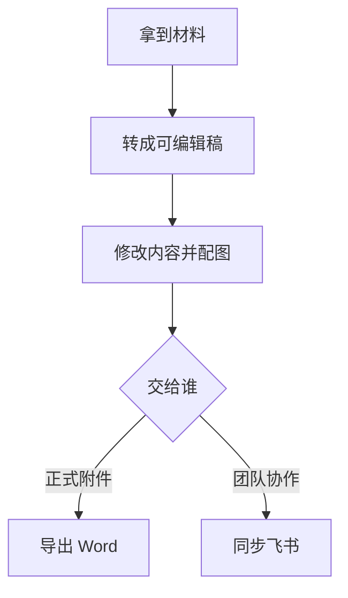

# jeemookit 用户手册

> 写文档、出图、导出 Word、同步飞书——用说话的方式完成，不必自己敲一堆命令。

| 项目 | 内容 |
|------|------|
| 产品 | jeemookit |
| 读者 | 产品、运营、项目、商务、文档撰写等非研发同学 |
| 版本 | 1.4.0 |
| 一句话 | 在 Cursor 里用 AI 把「写稿 → 配图 → 交 Word → 发飞书」串成一条流水线 |

---

## 1. 它能帮你做什么

很多同事的日常是这样的：

- 领导丢来一份 **PDF / Word**，要改成可编辑稿
- 自己写方案，要画 **流程图、架构图**，还要交 **正式 Word**
- 定稿后要发到 **飞书**，方便大家评论、转发

**jeemookit** 就是为这些场景准备的工具包。你打开 Cursor，用中文对 AI 说需求，它就会按统一规范帮你完成转换、配图和导出。


*图：从写文档到出图、导出 Word、同步飞书的完整路径*

### 你能立刻获得的价值

| 价值 | 说明 |
|------|------|
| **少返工** | 一次写稿，可同时交付 Word 与飞书，格式更整齐 |
| **图不用另找设计师** | 流程/架构用示意图；宣传场景可自动生成配图 |
| **说法简单** | 对 AI 说「转成 MD」「导出 Word」「上传飞书」即可 |
| **团队口径一致** | 文档目录、配图规则、交付格式有统一约定 |


---

## 2. 适合谁用

| 角色 | 典型用法 |
|------|----------|
| 产品 / 项目经理 | 写需求说明、方案摘要，导出 Word 发给干系人 |
| 运营 / 市场 | 产品介绍、宣传说明，配场景图后同步飞书 |
| 商务 / 售前 | 把客户 PDF 材料转成可编辑稿，再整理成方案 |
| 行政 / 综合岗 | 公文、通知类 PDF（含扫描件）转文字后修改 |
| 与研发协作的同学 | 自己出初稿与配图，研发同事继续深化，不必卡在工具链上 |

> 你不需要会写代码。只需要会打开 Cursor、会用中文描述「我要做什么」。

---

## 3. 第一次使用（请研发同事帮你装好一次）

工具需要安装在电脑上的 Cursor 环境里。**第一次建议请研发或 IT 同事完成安装**（大约几分钟），之后你只需打开对话使用。

安装完成后，请确认：

1. 电脑已安装 **Cursor**
2. 同事已运行过 jeemookit 的一键安装
3. 你能新开一个 **Agent 对话**（和 AI 聊天的窗口）

飞书上传/下载若要用，还需同事帮你配置一次飞书应用授权（浏览器登录你的飞书账号即可）。

装好后，**新开一次对话**再开始用，AI 才能稳定识别这些能力。

---

## 4. 你会用到的四种说法

记住下面四句就够覆盖大部分工作。把文件路径或飞书链接一起发给 AI 效果更好。

### ① 把别人的文件变成可编辑稿

| 你可以说 | 结果 |
|----------|------|
| 「把这份 PDF 转成 Markdown」 | 得到可编辑文字稿（扫描件也能认字） |
| 「把这份 Word 转成 Markdown」 | 保留标题、列表、表格，方便继续改 |

### ② 写方案时让 AI 出图

| 你可以说 | 结果 |
|----------|------|
| 「给这份方案补一张流程图」 | 自动生成清晰的流程示意图 |
| 「画一张整体架构图」 | 适合技术方案设计、功能说明 |
| 「加一张用户场景宣传图」 | 适合产品介绍、对外说明 |
| 「按专利交底书规范画附图」 | 黑白线稿、带图号，适合交底材料 |

### ③ 交正式 Word

| 你可以说 | 结果 |
|----------|------|
| 「导出 Word」 / 「生成 docx」 | 得到带图、带标题层级的正式 `.docx` |

### ④ 发到飞书给大家看

| 你可以说 | 结果 |
|----------|------|
| 「上传到飞书」 | 云文档链接，同事可在线看、评 |
| 「把这个飞书文档下载成 Markdown」 | 拉回本地继续改，再上传 |

---

## 5. 按场景跟做

### 场景 A：领导给了一份 PDF，要你改完再交 Word

1. 把 PDF 放进项目文件夹（或告诉 AI 完整路径）
2. 说：**「把这份 PDF 转成 Markdown」**
3. 在生成的文稿里改内容、改标题
4. 需要图时说：**「补一张流程图」**
5. 说：**「导出 Word」**，把 `.docx` 发出去

### 场景 B：自己写产品介绍，要发飞书

1. 让 AI 按提纲写初稿，或你先写要点
2. 说：**「按产品介绍规范配用户场景图」**
3. 说：**「上传到飞书」**，把链接丢进群里

### 场景 C：飞书上已有一版，要拿回来大改

1. 复制飞书文档链接
2. 说：**「把这个飞书文档下载成 Markdown」**
3. 本地改完后再说：**「上传到飞书」**（或让 AI 说明是更新还是新建）

### 场景 D：要交专利交底书 Word

1. 准备交底书正文要点
2. 说：**「按专利交底书规范写并画附图」**
3. 核对图号与说明是否一致
4. 说：**「导出 Word」** 交付



---

## 6. 使用小贴士

**说清楚目标，比说清楚技术更好。**  
例如：「我要给客户一份带流程图的方案 Word」比「帮我跑某某脚本」更有效。

**一次只推进一小步。**  
先转换 → 再改字 → 再配图 → 最后导出。中途检查一下，少返工。

**图片和正文放一起。**  
AI 会按规范把图放在文档旁边的文件夹里；不要随便挪文件名，否则导出 Word 时图可能丢失。

**飞书要先登录一次。**  
第一次「上传飞书」时，浏览器可能会弹出授权页，用你的飞书账号登录即可。

**正式对外稿，自己再扫一眼。**  
AI 很擅长排版和出图，但专有名词、数据、承诺表述请人工确认。

---

## 7. 常见问题

| 问题 | 建议 |
|------|------|
| AI 好像不会这些功能？ | 请同事确认已安装 jeemookit；然后**新开**一个 Agent 对话再试 |
| 扫描版 PDF 字不准？ | 可以转出来后再人工校对关键标题和表格；复杂表格有时会保留成图片 |
| 导出的 Word 里没有图？ | 告诉 AI「检查图片路径并重新导出」；不要手动改乱图片文件夹 |
| 飞书上传失败？ | 请同事检查飞书授权是否过期，重新说一次「登录飞书」后再上传 |
| 我能不能不用 Cursor？ | 当前能力主要在 Cursor 对话里触发；装好后你只需聊天，不必写代码 |
| 和研发用的是同一套吗？ | 是。你出初稿与配图，研发可在同一规范下继续完善，减少「格式对不齐」 |

---

## 8. 和研发同事怎么配合

| 你负责 | 研发同事负责 |
|--------|----------------|
| 用中文描述业务目标与交稿形式 | 首次安装、环境与飞书授权 |
| 核对文字、数据、对外口径 | 复杂模板、新 Skill、疑难排错 |
| 在飞书收集反馈 | 需要时把规范同步进项目约定 |

一句话协作口径：

> 「材料我用 jeemookit 转成可编辑稿并配好图了，Word / 飞书链接在这里；技术细节你接着补。」

---

## 9. 能力速查（给想多了解一点的人）

不必记名称，需要时把这张表转给研发即可。

| 你想做的事 | 能力名称（给研发看） |
|------------|----------------------|
| PDF 转可编辑稿 | pdf-to-md |
| Word 转可编辑稿 | word-to-md |
| 流程/架构/专利/宣传配图 | txt-to-image |
| 导出正式 Word | md-to-word |
| 上传飞书 | md-to-feishu |
| 飞书下载回本地 | feishu-to-md |

更细的命令与排错，见同目录技术文档：[产品使用说明书](README.md)。

---

## 10. 开始试用的三句话

复制到 Cursor 对话里，换成你的文件即可：

```text
请把「这里换成你的文件路径.pdf」转成 Markdown，转完告诉我生成了哪些文件。
```

```text
请根据当前文档补一张简洁的流程图，然后导出 Word。
```

```text
请把当前文档上传到飞书，并把链接发给我。
```

---

**jeemookit**：让文档写作、图示生成与协作交付更省事——你负责想清楚要什么，AI 负责把流水线跑通。
