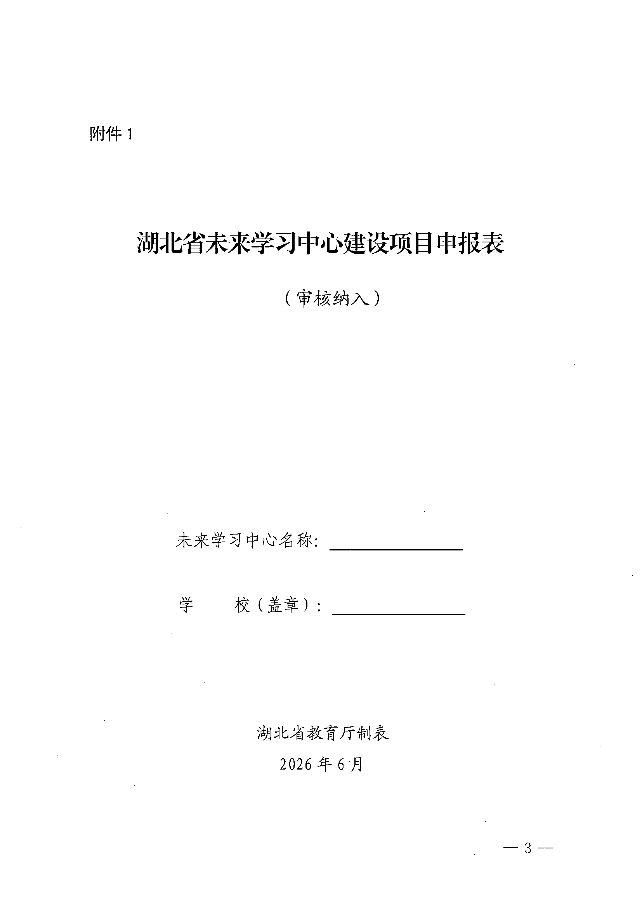
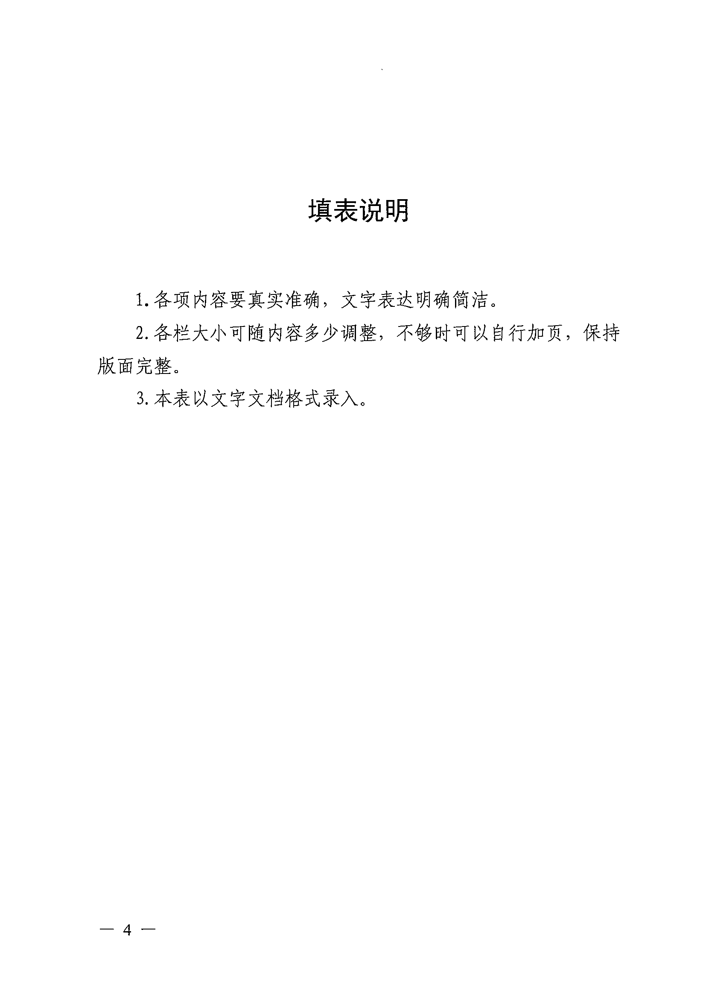
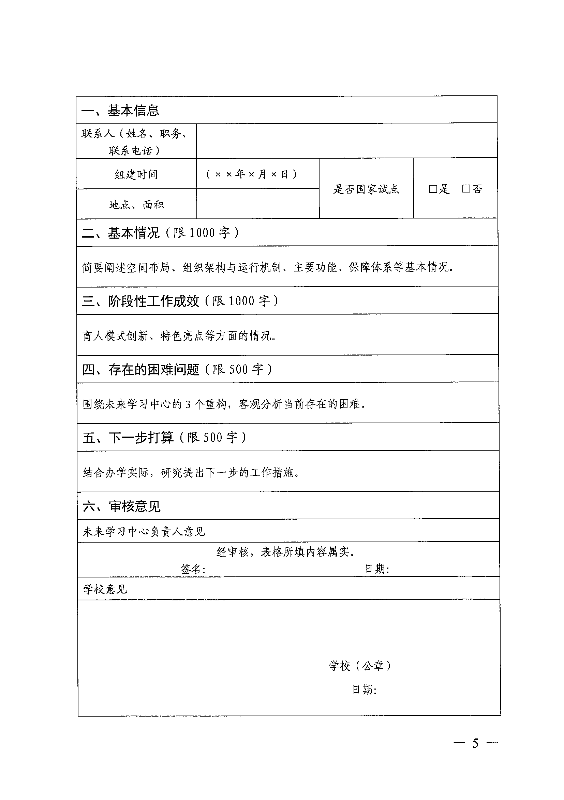
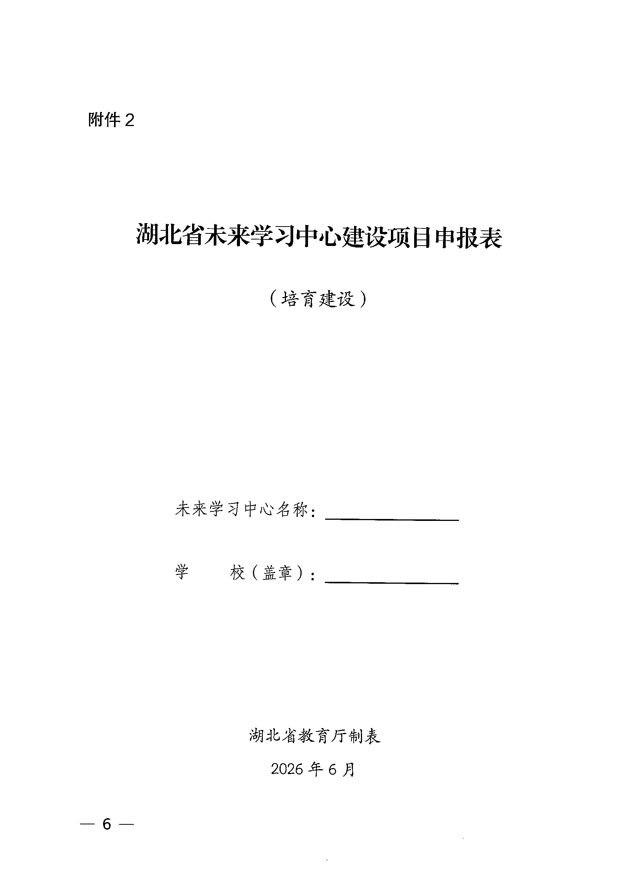
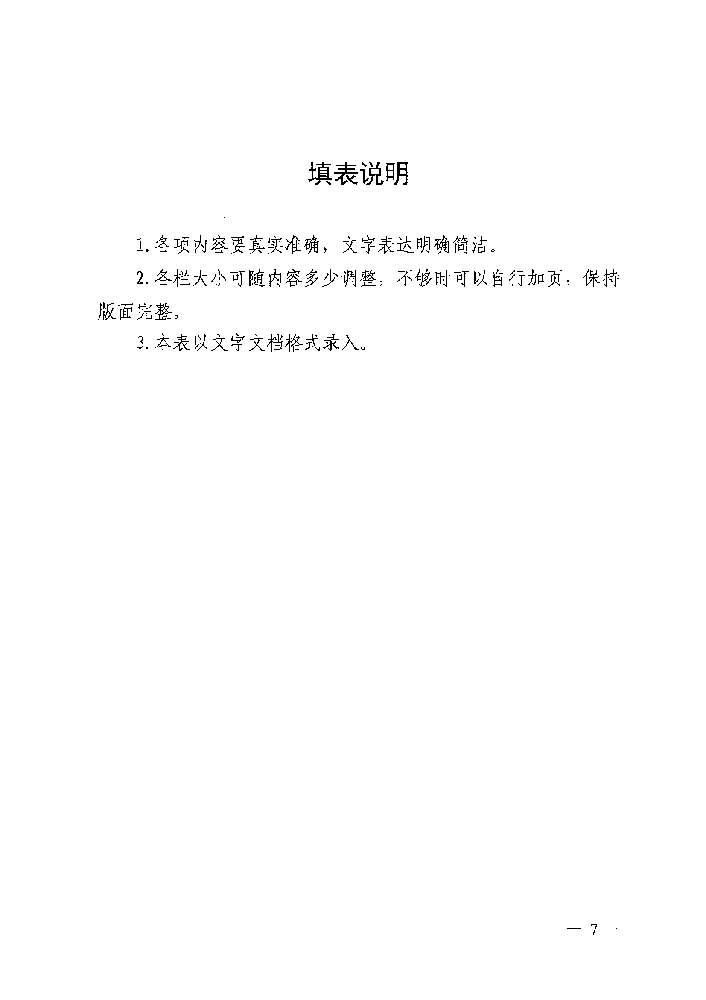
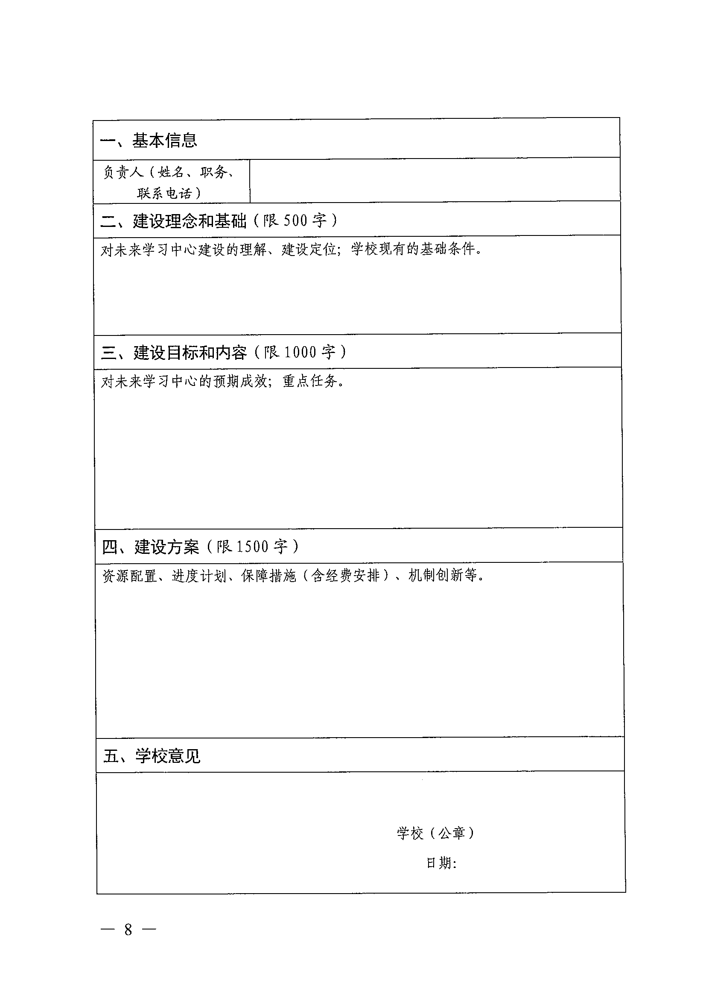

湖北省教育厅办公室鄂教高办函〔2026］11号

# 省教育厅办公室关于探索开展高校未来学习中心建设项目的通知

各普通本科高校：

为贯彻落实《“人工智能+教育”行动计划》（教科信［2026]1号）和《湖北省“人工智能+教育”三年行动方案（2026年-2028年）》（鄂教科［2026］1号）等文件精神，加快推动人工智能赋能高校人才培养，经研究，决定在本科高校探索开展未来学习中心建设项目工作，现将有关事项通知如下。

## 一、建设目标

坚持以学生为中心，突出育人为本，打造虚实融合的未来教育空间，建设能力驱动、泛在智能、多模态响应于一体的未来学习中心。

## 二、建设内容

通过人工智能技术，让更多优质资源走向学生，满足不同类型学习者个性化、多元化的学习需求，助力构建学习型社会。

1.重构学习生态，以数字技术为牵引，打造产教融合、科教融汇、学科交叉的跨界融合式学习空间。

2.重组学习要素，汇聚慕课、数字教材、虚拟仿真实验等全要素优质学习资源，为学生提供精准化个性化学习服务。

3.重构学习范式，基于教育规律，探索以能力为核心、以研究为导向、以志趣为动力的场景式、体验式学习范式，引导学生开展跨学科、项目式、探究式学习。

## 三、建设方式

按照审核纳入一批、培育新建一批分类推进。教育部未来学习中心试点高校或前期已启动建设且初见成效的高校，经申报、审核后可纳入为省级未来学习中心建设项目（填写附件1）；有建设意愿且具备一定建设基础的高校，经申报、审核后可纳入省级培育建设范围（填写附件2），建设完成后经验收可纳入为省级未来学习中心建设项目。

全省普通本科高校自主申报，每校限申报1个未来学习中心建设项目，超报不予受理。

## 四、材料报送

请申报高校于2026年7月10日（星期五）前将申报表（式样见附件）（含word文件和盖章扫描件）报送至省教育厅高等教育处。

联系人：余攀，联系电话：027-87328259，电子邮箱：hbjytgjc@e21.edu.cn.

附件：1.湖北省未来学习中心建设项目申报表（审核纳入）

2.湖北省未来学习中心建设项目申报表（培育建设）2026年6月17日办公室-2—

## 附件1

湖北省未来学习中心建设项目申报表（审核纳入）未来学习中心名称：校（盖章）:湖北省教育厅制表2026年6月

## 填表说明

1.各项内容要真实准确，文字表达明确简洁。

2.各栏大小可随内容多少调整，不够时可以自行加页，保持版面完整。

3.本表以文字文档格式录入。

## 一、基本信息

联系人（姓名、职务、联系电话）组建时间 （××年×月×日)是否国家试点 是否地点、面积

## 二、基本情况（限1000字）

简要阐述空间布局、组织架构与运行机制、主要功能、保障体系等基本情况。

## 三、阶段性工作成效（限1000字）

育人模式创新、特色亮点等方面的情况。

## 四、存在的困难问题（限500字）

围绕未来学习中心的3个重构，客观分析当前存在的困难。

## 五、下一步打算（限500字）

结合办学实际，研究提出下一步的工作措施。

## 六、审核意见

未来学习中心负责人意见经审核，表格所填内容属实。

签名： 日期：学校意见学校（公章）日期：15-

## 附件2

## 湖北省未来学习中心建设项目申报表

（培育建设）未来学习中心名称：学 校（盖章）：湖北省教育厅制表2026年6月

## 填表说明

1.各项内容要真实准确，文字表达明确简洁。

2.各栏大小可随内容多少调整，不够时可以自行加页，保持版面完整。

3.本表以文字文档格式录入。

## 一、基本信息

负责人（姓名、职务、联系电话）

## 二、建设理念和基础（限500字）

对未来学习中心建设的理解、建设定位；学校现有的基础条件。

## 三、建设目标和内容（限1000字）

对未来学习中心的预期成效；重点任务。

## 四、建设方案（限1500字）

资源配置、进度计划、保障措施（含经费安排）、机制创新等。

## 五、学校意见

学校（公章）日期：181

